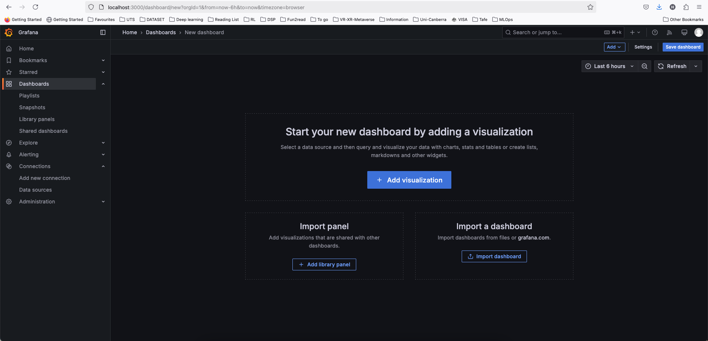
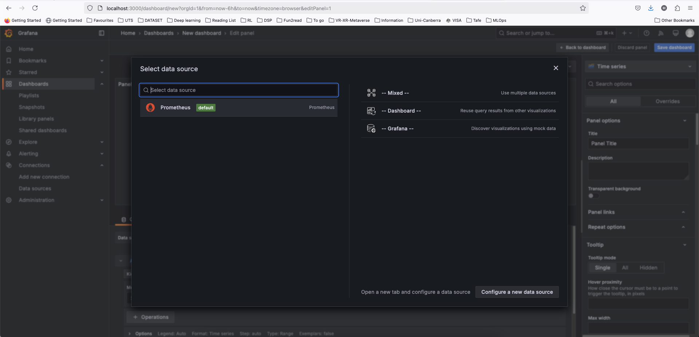
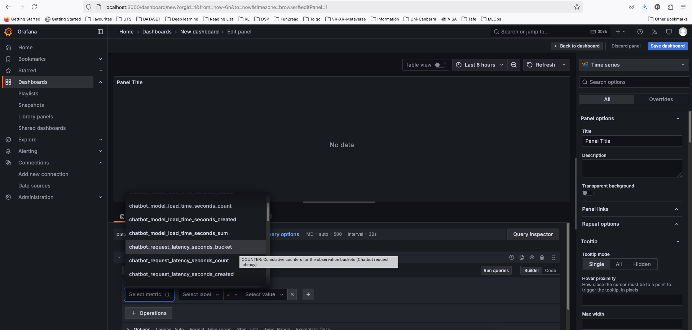
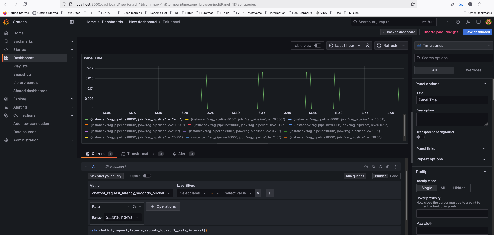

# Using Granafa Dashboard

## Login
Access to the Grafana dashboard using http://localhost:3000.   
Log in using user_name: admin, password: admin.   
You may need to change the password if required.

## Using Dashboard
### Create a new Dashboard
Click on '+' button on the top right corner of the window, then select "New Dashborad".
After that, select "Add visualization" then select data source as "Prometheus". See examples in the images below.  
  
   

### Visualizing Data
Selecting metrics from drop down menu on the dashboard, e.g., `chatbot_request_latency_seconds_buck`, `chatbot_memory_usage_bytes`, then click `Run queries`.
Data will show in graph window.  
   
 

