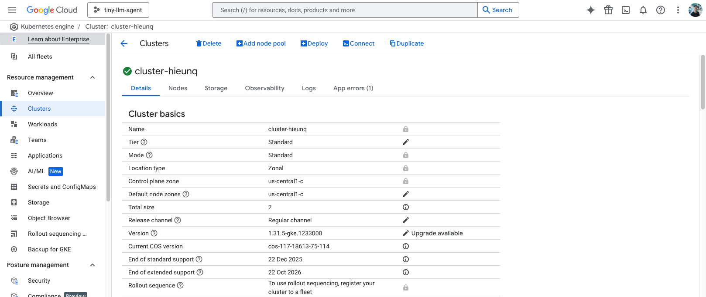

# Cloud Deployment Using Kubernetes

## Introduction
This guide demonstrates the steps to deploy **tiny-llm-agent** services on local cluster. The second part of this will be deploying the services on a Google Cloud Platform. All we need is `Kubernetes`. The deployment includes:  
- **Containerization**: Building and publishing Docker images for the services.  
- **Local Testing**: Running the system on **Minikube** and **Helm** before cloud deployment.  
- **Cloud Deployment**: Deploying on **Google Kubernetes Engine (GKE)** with autoscaling and monitoring.  

**Disclaimer**: The `tiny-llm-agent` is provided for the demonstration purpose. It is implemented to run on CPU to ensure compatibility with most hardware devices. Additionally, the response length is limited to a fixed number of tokens because the 0.5B LLM cannot efficiently handle very long contexts. Expanding beyond these limitations can be achieved by using a larger model (e.g., Qwen2.5-7B) and enabling GPU processing for faster responses. 

---

## Table of Contents

1. [Publishing Customized Docker Images](#1-publishing-customized-docker-images)
2. [Local Deployment with Minikube](#2-local-deployment-with-minikube)
   - [Create a new Kubernetes cluster](#create-a-new-kubernetes-cluster)
   - [Create the Namespace](#create-the-namespace)
   - [Apply the Deployment](#apply-the-deployment)
   - [Monitoring](#monitoring)
   - [Check service accessibility](#check-service-accessibility)
   - [Cleaning up](#cleaning-up)
3. [Local Deployment with Helm](#3-local-deployment-with-helm)
   - [Creating Helm chart templates](#creating-helm-chart-templates)
   - [Components](#components)
   - [Usage](#usage)
   - [Configuration](#configuration)
   - [Access points](#access-points)
4. [Deploy Services on Google Cloud Platform](#4-deploy-services-on-google-cloud-platform)
   - [Create new cluster on Google Cloud Platform](#create-new-cluster-on-google-cloud-platform)
   - [Update Helm configuration](#update-helm-configuration)
   - [Access points with external IPs](#access-points-with-external-ips)

---

## 1. Publishing Customized Docker Images
First step is publishing the docker images to the image registry (Docker Hub). 
- Step 1: Log in to Docker Hub
```bash
docker login
```

- Step 2: Create a repository on Docker Hub
Go to [https://hub.docker.com/](https://hub.docker.com/), log in, and manually create a repository, e.g., Namespace `model-serving` and repositories name`tiny-llm-agent-rag-pipeline` and `tiny-llm-agent-streamlit`.

- Step 3: Build and push Docker images to Docker Hub.
Assuming we are at `tiny-llm-agent/` root directory, to build and push images to Docker Hub:  
```bash
cd rag-pipeline  
docker buildx build --platform linux/amd64,linux/arm64 -t hieunq95/tiny-llm-agent-rag-pipeline:v0.1.1 --push .
```

```bash
cd streamlit  
docker buildx build --platform linux/amd64,linux/arm64 -t hieunq95/tiny-llm-agent-streamlit:v0.1.0 --push .
```  

```bash
cd nginx  
docker buildx build --platform linux/amd64,linux/arm64 -t hieunq95/tiny-llm-agent-nginx:v0.1.0 --push .
```
 - The above steps just build and push images of the backend (rag-pipeline), frontend (streamlit), and proxy (nginx) to Docker Hub. The `--platform` parameter is to support multi-platform build in Docker `buildx`. This will take time, depends on the network connection. 
---

## 2. Local Deployment with Minikube
Before deploying all services (LLM chatbot backend, frontend, and monitoring services) to the Google Cloud, let's use `minikube` for local deployment and testing.   

- Let's install `minikube` by following this [instruction](https://minikube.sigs.k8s.io/docs/start/?arch=%2Fmacos%2Fx86-64%2Fstable%2Fbinary+download).  
 
- We also need `kubectl` to run command in Kubernetes clusters. To install `kubectl`, follow this [instruction](https://kubernetes.io/docs/tasks/tools/#kubectl).

- And install `helm` for automatic deployment on Kubernetes clusters, follow this [instruction](https://helm.sh/docs/intro/install/#from-script).

### Create a new Kubernetes cluster
To create a new Kubernetes cluster, run the command:  
```bash
minikube start --cpus=max --memory=max
```  
To check the status of the cluster, run:
```bash 
minikube status
```
To stop `minikube`:
```bash
minikube stop
minikube delete
```  

### Create the Namespace
Assuming we are at `tiny-llm-agent/` root directory, navigating to the `kubernetes` directory:  
```bash
cd kubernetes
```  

If the name space `model-serving` (as in the `deployment.yaml` file) does not exist, let's create the namespace first:
```bash
kubectl create namespace model-serving
```  
Then check if it is created successfully:  
```bash
kubectl get namespaces
```

### Apply the Deployment
Let's quickly test the frontend and backend services without deploying a proxy server. First, apply the deployment:
```bash
kubectl apply -f deployment.yaml
```  
To verify the pods:  
```bash
kubectl get pods -n model-serving
```  
To describe pod:  
```bash
kubectl describe pod -n model-serving
```
Then, apply the services (make sure the pod is running):
```bash 
kubectl apply -f backend-service.yaml
kubectl apply -f frontend-service.yaml
```

### Monitoring  
#### Check logs:
```bash
kubectl logs -n model-serving pod_name -c backend
kubectl logs -n model-serving pod_name -c frontend
```

Check services:  
```bash
kubectl get svc -n model-serving
```

#### Check service accessibility
Check if the services are accessible:
```bash
kubectl port-forward -n model-serving svc/rag-pipeline 8000:8000
kubectl port-forward -n model-serving svc/streamlit 8501:8501
```   
Then, visit in browser:  
- Backend: `http://localhost:8000/docs`
- Frontend: `http://localhost:8501`

### Cleaning up
To delete everything:
```bash
kubectl delete deployment mydeployment -n model-serving
kubectl delete namespace model-serving
docker stop minikube
docker remove minikube
```

---

## 3. Local Deployment with Helm
Using `helm` allows more automation and customization compared to `kubectl` when deploying. 
### Creating helm chart templates
The structure of the `helm-chart` directory is as follows:  
```
helm-chart/
│── templates/                      # Kubernetes manifests for Helm
│   ├── backend-deployment.yaml     # Backend deployment definition
│   ├── backend-service.yaml        # Backend service definition
│   ├── frontend-deployment.yaml    # Frontend deployment definition
│   ├── frontend-service.yaml       # Frontend service definition
│   ├── proxy-deployment.yaml       # Proxy deployment definition
│   ├── proxy-service.yaml          # Proxy service definition
│   ├── namespace.yaml              # Namespace definition
│── Chart.yaml                      # Helm chart metadata
│── values.yaml                     # Configuration values
```

### Components
The components of the `helm-chart`:
- **Backend**: API service that processes requests.  
- **Frontend**: Web interface for users.    
- **Proxy**: Reverse proxy service for serving external requests from users.   

### Usage

Assuming the `minikube` cluster is running. Otherwise, start a new cluster using command:  
```bash
minikube start --cpus=max --memory=max
```
To deploy the services locally, using `helm`:  
```bash
cd helm-chart/
```  
To install the Helm chart:  
```bash
helm install tiny-llm-agent .
```  
To upgrade an existing deployment:  
```bash
helm upgrade tiny-llm-agent .
```  
To uninstall the chart:  
```bash
helm uninstall tiny-llm-agent
```

### Configuration 
Edit the `values.yaml` file to customize the deployment. Key configurations include:  
- Namespace  
- Container images and versions  
- Resource limits  
- Service types  

### Access points  
#### For developers
Let's use port-forward to access to the internal services:
```bash
kubectl port-forward -n model-serving svc/rag-pipeline 8000:8000
kubectl port-forward -n model-serving svc/streamlit 8501:8501
```   
Then, visit in browser:  
- Backend: `http://localhost:8000/docs`
- Frontend: `http://localhost:8501`

#### For users
Users need to access the services via a proxy server (`nginx`). To expose the proxy port, run:  
```bash
minikube service proxy -n model-serving     
```
The log looks like this:
```
|---------------|-------|-------------|---------------------------|
|   NAMESPACE   | NAME  | TARGET PORT |            URL            |
|---------------|-------|-------------|---------------------------|
| model-serving | proxy |          80 | http://192.168.49.2:30080 |
|---------------|-------|-------------|---------------------------|
🏃  Starting tunnel for service proxy.
|---------------|-------|-------------|------------------------|
|   NAMESPACE   | NAME  | TARGET PORT |          URL           |
|---------------|-------|-------------|------------------------|
| model-serving | proxy |             | http://127.0.0.1:62587 |
|---------------|-------|-------------|------------------------|
```  

Then, visit in browser: `http://192.168.49.2:30080` or `http://127.0.0.1:62587`. Both access methods should be working.  

---

## 4. Deploy Services on Google Cloud Platform
### Create new cluster on Google Cloud Platform
First, let's create a Kubernetes Engine cluster on Google Cloud Platform.  
An example cluster with Kubernetes Engine:  
  

### Update helm configuration
Change service type for both frontend and backend in `helm-chart/values.yaml` for GCP:
```
service:
    type: LoadBalancer # use `NodePort` (local deployment) or `LoadBalancer` (cloud deployment)
```
and also change the number of replicas:
```
deployment:
  name: mydeployment
  replicas: 2  # use `2` replicas for cloud deployment (optional)
```

After connecting to the GCP using [gcloud](https://cloud.google.com/sdk/docs/install) CLI, make sure to scale the number of nodes in the node pool to `3` or higher for sufficient computing capacity:  
```bash
gcloud container clusters resize cluster-hieunq --node-pool default-pool --num-nodes 3 --zone us-central1-c
```
where `cluster-hieunq` is cluster's name, `default-pool` is the node pool's name, and `us-central1-c` is the zonal/regional name.  
Alternatively, we can enable cluster autoscaling:  
```bash
gcloud container clusters update cluster-hieunq \
  --zone=us-central1-c \
  --enable-autoscaling \
  --min-nodes=2 \
  --max-nodes=5
```

Now, let's install helm chart on the GCP with namespace `model-serving`:  
```bash
helm install tiny-llm-agent .
```  
To upgrade an existing deployment:  
```bash
helm upgrade tiny-llm-agent .
```  
To uninstall the chart:  
```bash
helm uninstall tiny-llm-agent
```
### Access points with external IPs
To get the running services on the pod:  
```bash
kubectl get svc -n model-serving
```
The output shows something like this:
```
NAME           TYPE           CLUSTER-IP       EXTERNAL-IP     PORT(S)          AGE
rag-pipeline   LoadBalancer   34.118.228.91    34.132.15.181   8000:30080/TCP   55s
streamlit      LoadBalancer   34.118.239.245   34.58.203.53    8501:30081/TCP   55s
```  
Access to the services using the external IP address:
- Frontend: `34.58.203.53:8501`  
- Backend (FastAPI): `34.132.15.181:8000/docs`

---